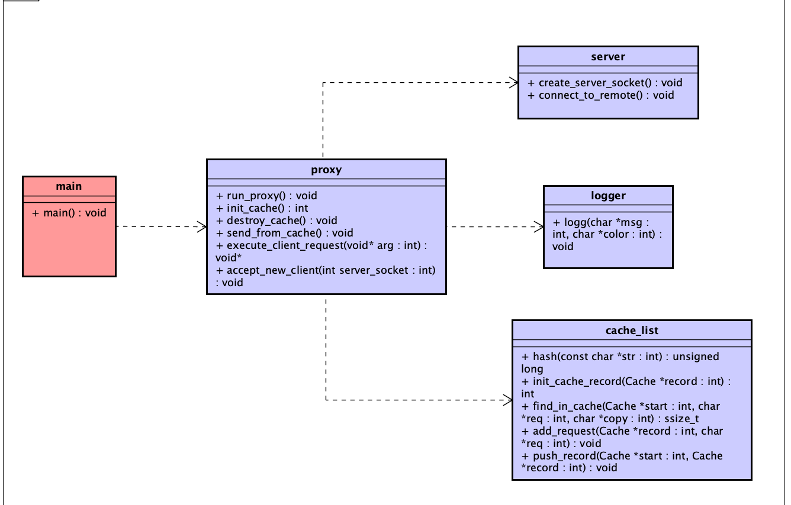

## Реализуйте многопоточный кэширующий HTTP-proxy (версия HTTP 1.0).

Прокси должен принимать соединения на 80 порту и возвращать данные из кэша.   

В случае если для запроса нет записей в кэше, то должен быть создан отдельный поток,
который загрузит в кэш требуемые данные.

Данные должны пересылаться клиенту как только они начали появляться в кэше.

Реализуйте простой кэширующий HTTP-proxy с кэшем в оперативной памяти.

Прокси должен быть реализован как один процесс и один поток, использующий для одновременной 
работы с несколькими сетевыми соединениями системный вызов select или poll.
Прокси должен обеспечивать одновременную работу нескольких клиентов
(один клиент не должен ждать завершения запроса или этапа обработки запроса другого клиента).

Реализовать задачу 31, используя рабочие потоки (worked threads).
При запуске прокси должен принимать параметр, целое число, указывающее размер пула потоков. 

Прокси должен запустить указанное число нитей.
Необходимо обеспечить одновременную обработку количества запросов, превосходящего количество нитей в пуле;
блокировка входящих соединений недопустима. 

Разумеется, при этом каждая из нитей в разные моменты времени будет вынуждена обрабатывать разные соединения. 
Для управления соединениями используйте select или poll.

Пример запроса: curl --http1.0 -i -x 127.0.0.1:90 http://www.google.com/

